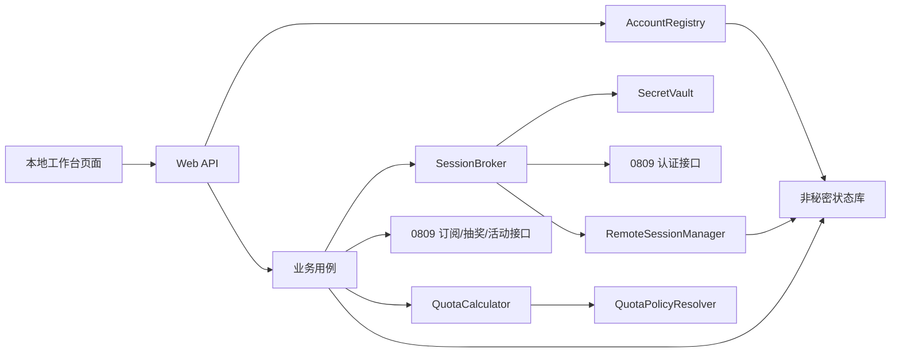
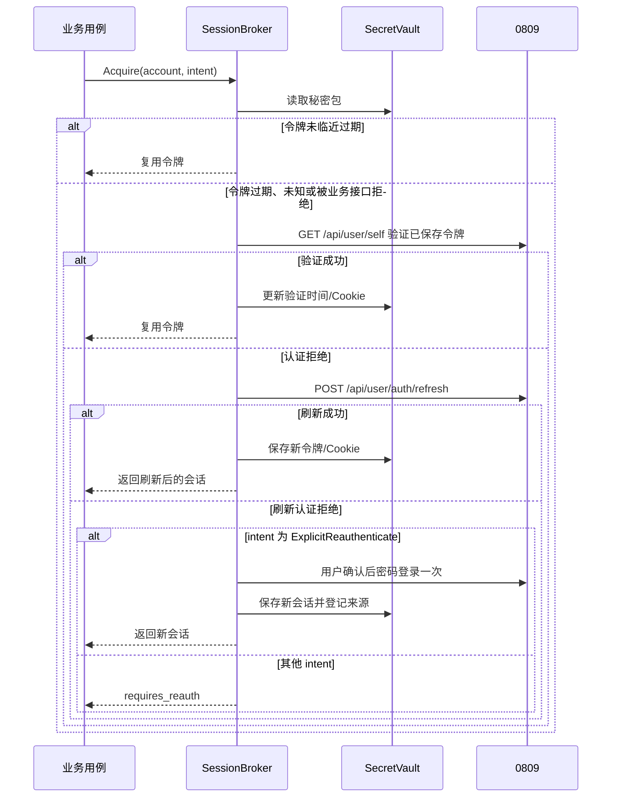
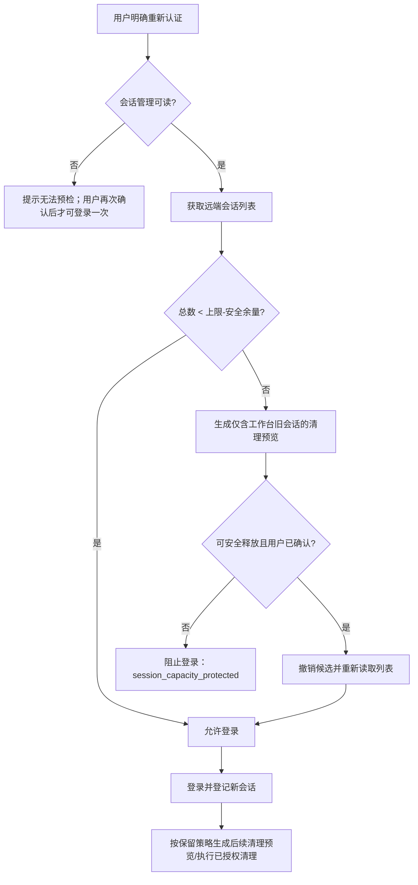

# 0809 多账号工作台重构详细设计

**版本：** 1.0  
**日期：** 2026-08-29  
**对应需求：** `2026-08-29-account-workbench-refactor-requirements.md`  
**状态：** 待评审

## 1. 设计结论

本次重构采用以下基线方案：

| 问题 | 设计决策 |
| --- | --- |
| 固定五账号 | 使用持久化账号注册表，账号 ID 为稳定 UUID；旧 `account-a` 至 `account-e` 在迁移期保留原 ID。 |
| 密码与令牌混存 | 账号元数据、业务状态与秘密材料分离；秘密进入 `SecretVault`，普通状态文件不再保存令牌或 Cookie。 |
| 自动登录堆积会话 | 引入 `SessionBroker`，所有业务操作共享认证状态；密码登录仅由显式重新认证用例触发。 |
| 旧会话清理 | 引入能力受限的 `RemoteSessionManager`。未验证接口时只报告不可用，绝不调用猜测的远端路径。 |
| 额度换算不可靠 | 用带来源和规则版本的 `MoneyAmount`/`QuotaAmount` 取代裸 `float64`；先验证平台语义，再启用对应公式。 |
| 现有功能 | 既有 Runner、动作幂等、自动抽奖计划和日志保留，逐步改为依赖账号注册表和 SessionBroker。 |

工作台仍是单用户、本地访问控制下的单页工具。它不提供跨账号统计或批量操作。

## 2. 现状与改造点

当前实现的关键事实：

- `internal/config` 从五组 `ACCOUNT_*` 环境变量构造账号，并将密码直接传入业务 Runner。
- `internal/state` 的版本 3 状态文件同时存储 Cookie、父令牌、活动令牌、动作、快照、自动抽奖计划和日志。
- `Runner.ensureParentTokenAfter` 已具备“缓存令牌 -> `/api/user/self` 验证 -> `/api/user/auth/refresh`”的顺序和账号锁，但刷新收到 `401/403` 后仍会自动调用密码登录。
- 当前额度换算为 `raw / quota_per_unit`，没有使用或验证 `quota_display_type`、`usd_exchange_rate` 的实际语义。
- 已实现的业务接口中没有可确认的远端登出、会话列表或会话撤销方法。

因此这不是把密码登录换成另一条请求，而是将认证从各业务方法的隐式副作用改成明确的会话生命周期。

## 3. 目标架构



### 3.1 模块边界

| 模块 | 责任 | 不负责 |
| --- | --- | --- |
| `internal/account` | 账号元数据、启停、删除、唯一远端用户绑定 | 密码、Cookie、令牌 |
| `internal/secret` | OS 钥匙串/部署秘密库适配器，读写账号秘密包 | 向 Web API 暴露任何秘密 |
| `internal/auth` | SessionBroker、认证状态机、单账号认证锁、会话账本 | 订阅与抽奖业务规则 |
| `internal/platform` | 0809 客户端、认证和会话接口适配 | 本地权限和状态持久化策略 |
| `internal/quota` | 精确金额、换算规则、来源和规则快照 | 从 UI 猜测金额含义 |
| `internal/service` | 签到、领取、抽奖、购买、查询、自动抽奖等用例 | 直接读取密码或直接登录 |
| `internal/state` | 非秘密的动作、快照、调度、日志、注册表存储与锁 | 令牌、Cookie、密码 |
| `internal/web` | 本地 API、页面、CSRF/同源校验、DTO 白名单 | 上游原始响应透传 |

现有 `service.Runner` 可分阶段迁移为依赖 `AccountResolver` 和 `SessionBroker`，无需一次性重写各业务动作。

## 4. 数据模型与存储边界

### 4.1 账号注册表

注册表保存在权限为 `0600` 的非秘密状态文件中，使用现有原子写入与进程锁策略。建议模型如下：

```text
AccountRecord
  id: string                 // UUID；迁移账号沿用 account-a 等旧 ID
  label: string
  enabled: bool
  masked_login_name: string
  remote_user_id: int64?     // 首次认证成功后写入，用于防止重复绑定
  created_at, updated_at
  auth_health: AuthHealth    // 无秘密的 public 状态
  auto_draw_enabled: bool

AuthHealth
  state: usable | refreshable | requires_reauth | session_capacity_protected | unavailable
  checked_at: time
  safe_reason: string
```

登录名原文只保存在秘密库；注册表只保存用于展示的脱敏版本。删除账号时先停用并取消其待执行自动抽奖计划，然后删除秘密和该账号范围内的动作、快照、计划与日志。删除接口必须要求明确确认。

### 4.2 秘密包

`SecretVault` 是唯一可以存放以下内容的边界：

```text
AccountSecretBundle
  login_name
  password?                         // 用户选择保存时才存在
  user_id
  parent_access_token, expires_at
  lottery_access_token, expires_at
  cookies
  managed_remote_sessions[]         // 远端 session ID 及仅供匹配的元数据
```

实现以接口隔离环境差异：

```go
type SecretVault interface {
    Load(ctx context.Context, accountID string) (AccountSecretBundle, error)
    Save(ctx context.Context, accountID string, bundle AccountSecretBundle) error
    Delete(ctx context.Context, accountID string) error
}
```

首选适配器是操作系统钥匙串或部署环境已有的秘密库。若没有可用秘密库，账号可以存在但 `auth_health` 必须为 `requires_reauth`；不得将密码回退到注册表、环境变量、普通 JSON、浏览器 Storage 或运行日志。

### 4.3 非秘密状态库版本 4

状态库继续保存业务信息，但版本 4 删除 `AuthState` 中的秘密字段。应保留：

- `AccountRecord`；
- 签到、领取、购买、抽奖的幂等动作和结果摘要；
- 订阅、抽奖次数、活动信息和额度快照；
- 自动抽奖计划、执行结果和七天运行日志；
- 会话清理的非秘密审计摘要，例如账号 ID、保留数、删除数、时间、结果码和适配器版本。

`Snapshot.Data` 必须只接收明确的业务 DTO，禁止写入上游完整响应。秘密库读取失败、上游认证错误和会话容量错误均以结构化安全码存入日志，不存入原始错误对象。

## 5. 认证状态机

### 5.1 认证获取接口

所有用例使用以下入口；`intent` 决定是否允许密码登录：

```go
type AuthIntent string

const (
    ReadOnly             AuthIntent = "read_only"
    SideEffect           AuthIntent = "side_effect"
    ScheduledAutomation  AuthIntent = "scheduled_automation"
    ExplicitReauthenticate AuthIntent = "explicit_reauthenticate"
)

type SessionBroker interface {
    Acquire(ctx context.Context, accountID string, intent AuthIntent) (PlatformSession, error)
}
```

`ReadOnly`、`SideEffect` 与 `ScheduledAutomation` 绝不允许密码登录；只有用户确认的 `ExplicitReauthenticate` 可进入登录分支。

### 5.2 获取流程



详细规则：

1. 认证锁键为账号 ID；锁内必须重新从秘密库加载最新状态，避免等待者使用过期副本。
2. 令牌到期时间只是本地提示。临近到期、缺失或上游 `401/403` 时，优先调用无登录副作用的验证接口。
3. 刷新仅在验证的认证拒绝后调用一次。刷新成功后重试原业务请求一次；失败不触发第二次刷新或隐式登录。
4. 网络错误、5xx、429、解析错误和超时直接返回可重试的安全错误，不改变为密码登录。
5. 自动抽奖在 `requires_reauth` 状态下写入“跳过：需要重新认证”并结束当前窗口计划，不重试、不创建会话。
6. 登录、刷新、桥接后收到新 Cookie 或可识别会话标识时，必须交给会话账本判断是否发生了远端会话变化；不能仅凭当前代码注释假定刷新不占会话名额。

## 6. 远端会话生命周期

### 6.1 能力模型

平台会话管理被建模为可选能力，而不是预设 URL：

```go
type SessionCapability string

const (
    SessionUnsupported SessionCapability = "unsupported"
    SessionReadable    SessionCapability = "readable"
    SessionRevocable   SessionCapability = "revocable"
)

type RemoteSessionManager interface {
    Capability(ctx context.Context) (SessionCapability, error)
    List(ctx context.Context, session PlatformSession) ([]RemoteSession, error)
    Revoke(ctx context.Context, session PlatformSession, remoteSessionID string) error
}
```

实现前必须通过平台前端网络请求或官方接口契约确认列表与撤销端点、鉴权、稳定 session ID、分页、当前会话标识、撤销结果与幂等语义。验证结果以适配器版本记录；未验证时 `Capability` 固定为 `unsupported`，不会发送探测性删除请求。

### 6.2 会话账本与保留策略

秘密库内为每个可识别的工作台会话保存：远端 ID、创建/最后验证时间、来源（显式登录/刷新/桥接）、是否当前活跃、是否固定保留和撤销状态。普通状态仅保存计数和脱敏结果。

默认策略：

```text
platform_session_limit = 50        // 部署配置，可随平台实测调整
session_safety_margin = 5
durable_session_limit = 2          // 每账号，可设为 1..3
cleanup_order = oldest workbench-owned, non-active session first
```

只有同时满足以下条件的会话才可删除：

1. 会话 ID 已在本地秘密账本登记为工作台创建；
2. 当前远端列表仍返回完全匹配的会话；
3. 不是当前活跃会话，不是用户固定保留会话，不在保留数量内；
4. 用户已经在预览中确认过本次清理范围或启用了相同范围的自动清理策略。

未知会话、迁移前无法关联的旧会话、浏览器/手机会话和列表中无稳定 ID 的条目一律不删除。

### 6.3 登录前预检与清理流程



如果远端会话读取或撤销失败，禁止把结果标为成功；失败不改变本地“已撤销”状态。重新认证仍是人工风险决策，工作台必须显示可能新建一个会话，但不允许后台路径借此绕过容量保护。

## 7. 实际额度计算

### 7.1 金额模型

内部计算使用十进制字符串或定点十进制类型；不得把金额作为 `float64` 贯穿领域模型。对外 API 使用结构化金额：

```json
{
  "currency": "USD",
  "value": "12.345678",
  "display": "$12.35",
  "state": "confirmed",
  "source": "subscription.amount_total",
  "formula": "quota-per-unit-v1",
  "observed_at": "2026-08-29T00:00:00Z"
}
```

金额状态为 `confirmed`、`unverified` 或 `unavailable`。后两种状态不输出伪造的美元 `value`/`display`，页面显示“额度换算待确认”或“暂不可计算”。

### 7.2 换算规则解析

`QuotaPolicyResolver` 根据来源字段和同次查询获得的 `/api/status` 快照选择一个版本化规则。规则不是根据字段名猜测，而是通过脱敏真实响应与平台页面显示值对照后登记。

```text
QuotaPolicy
  id: already-usd-v1 | quota-per-unit-v1 | verified-custom-vN
  source_fields: 允许使用的上游字段
  input_semantics: already_usd | native_quota | custom_currency
  formula: 精确计算表达式
  status_snapshot: quota_per_unit, quota_display_type,
                   usd_exchange_rate, custom_currency_*, observed_at
```

允许的基线公式只有：

- `already-usd-v1`：平台契约明确字段本身为美元，`usd = raw`；
- `quota-per-unit-v1`：平台契约明确 `quota_per_unit` 表示每 1 美元的原生额度，`usd = raw / quota_per_unit`；
- `verified-custom-vN`：仅在平台显示类型、报价币种及汇率含义已经验证后登记，公式与样例一起版本化。

`usd_exchange_rate` 不能因为名称中含 USD 就自动参与计算。它的方向、适用字段和有效期必须经验证；在验证前仅作为状态快照保存，不进入金额公式。

### 7.3 业务口径

1. 订阅：分别读取 `amount_total` 和 `amount_used`，计算 `remaining_raw = max(total_raw - used_raw, 0)` 后以同一规则换算。有限订阅显示总额、已用、剩余、到期；无限订阅只显示无限和状态。
2. 用户用量：`/api/user/self` 返回的配额与已用配额独立展示为“用户用量来源”，不与订阅余额自动相加。
3. 签到/抽奖奖励：保存动作发生时的原始值和当时的规则快照；历史记录不会因以后平台改汇率而改写。
4. 活动、购买价格和消费档位：只有在平台契约确认它们已是美元时才标记为 `already-usd-v1`。否则走对应原生规则或标记为待确认。
5. 页面只做展示格式化，所有比较（购买核对、档位差额、余额变化）使用未圆整的十进制值。

### 7.4 更新与可追溯性

单账号刷新订阅、活动信息、签到、购买或抽奖成功后，工作台只刷新该账号相关快照。每个快照包含来源端点、查询时间、规则版本和状态配置快照。账号列表初始加载只读取本地快照，不对所有账号发起上游请求。

## 8. Web API 与页面交互

所有接口继续受本地访问控制保护。所有变更请求同时要求同源 `Origin`/`Referer` 校验和 CSRF 令牌；密码字段禁止写入访问日志。

### 8.1 新增账号管理接口

| 方法 | 路径 | 说明 |
| --- | --- | --- |
| `POST` | `/api/accounts` | 新增账号；请求中可含一次性登录名/密码，响应只含脱敏元数据。新增后默认不登录。 |
| `PATCH` | `/api/accounts/{id}` | 修改显示名称、启用状态、自动抽奖开关。 |
| `PUT` | `/api/accounts/{id}/credentials` | 更新秘密库中的登录名/密码；不自动登录。 |
| `POST` | `/api/accounts/{id}/auth/validate` | 验证已保存会话，不使用密码登录。 |
| `POST` | `/api/accounts/{id}/auth/re-authenticate` | 用户明确确认后执行一次密码登录和容量预检。 |
| `GET` | `/api/accounts/{id}/sessions/cleanup-preview` | 返回可安全清理的已知工作台会话及保留理由。 |
| `POST` | `/api/accounts/{id}/sessions/cleanup` | 执行用户确认过的预览；远端能力不可用时返回明确状态。 |
| `DELETE` | `/api/accounts/{id}` | 确认后停用、删除本地秘密和账号级状态。 |

响应中的认证信息只允许：`usable`、`refreshable`、`requires_reauth`、`session_capacity_protected`、`unavailable` 与脱敏说明。

### 8.2 保留的业务接口

现有单账号动作路径保持兼容：

- `POST /api/accounts/{id}/checkin`
- `POST /api/accounts/{id}/claim`
- `POST /api/accounts/{id}/draw`
- `POST /api/accounts/{id}/activity`
- `POST /api/accounts/{id}/purchase-draw`
- `POST /api/accounts/{id}/unlock-pass`
- `POST /api/draw-count/query`
- `POST /api/subscriptions/query`
- `GET /api/auto-draw-status`
- `GET /api/runtime-logs`

这些接口改由 SessionBroker 取得会话。接口出现 `requires_reauth`、`session_capacity_protected` 或 `quota_conversion_unverified` 时返回稳定错误码与可展示文本，不返回上游原始错误或认证材料。

### 8.3 页面结构

页面顶栏只提供“新增账号”和系统日志入口，不显示跨账号总额。每张卡片包含：

1. 标题区：显示名称、脱敏登录名、启停状态、认证状态和最近查询时间；
2. 额度区：订阅/用量/奖励的美元金额、来源和待确认状态；
3. 业务区：保留签到、领取、抽奖次数、手动抽奖、活动、购买和自动抽奖进度；
4. 会话区：验证会话、显式重新认证、清理预览和清理结果；不显示任何令牌、Cookie 或会话 ID；
5. 账号菜单：编辑、停用、删除。

桌面端动作组按用途分行；窄屏改为纵向布局。账号名称和反馈文本允许断行，按钮使用固定最小宽度，页面不得产生横向滚动。

## 9. 迁移、发布与回滚

### 9.1 迁移流程

1. 以只读方式读取旧环境变量配置和版本 3 状态文件，建立迁移预览；不打印值。
2. 为每个旧账号创建注册表记录，保留旧账号 ID、标签、动作、快照、计划与日志。
3. 将旧环境配置中的登录名/密码，以及旧 `AuthState` 中的 Cookie、令牌和用户 ID 写入 SecretVault；逐项回读校验成功后才继续。
4. 原子写入版本 4 非秘密状态，删除认证材料字段。迁移在任何秘密库写入失败时中止且不修改旧状态。
5. 首次启动只展示迁移结果与认证健康状态，不自动查询、不自动刷新、不自动登录。
6. 旧状态文件中的秘密材料不做自动备份复制；迁移完成后由受控原子替换移除。部署方如需备份，必须在工作台之外使用同等级秘密保护措施。

### 9.2 分阶段发布

1. 先发布账号注册表、SecretVault 和“禁止自动密码登录”开关，保持远端会话清理适配器禁用。
2. 验证已有账号可仅靠保存会话完成现有业务；认证失效时只显示重新认证需求。
3. 单独完成平台会话接口契约验证和模拟测试后，启用 `RemoteSessionManager` 的只读预览。
4. 用户确认预览准确后，启用撤销能力和保留策略。
5. 用脱敏真实样例校对额度规则后，启用对应 `QuotaPolicy`；未校对字段继续展示待确认。

### 9.3 回滚原则

若新认证或会话管理异常，立即禁用远端清理与密码重新认证入口，保留只读本地快照和既有业务状态。不得通过恢复旧的自动密码登录逻辑来“修复”问题。SecretVault 中的会话可继续由受控恢复工具读取，但不得重新写回普通 JSON 状态文件。

## 10. 测试与验证

### 10.1 单元与回归测试

- 账号新增、编辑、停用、删除、重复远端用户 ID 和迁移 ID 保持；
- SecretVault 读写失败时无秘密降级；API、日志、快照和错误 DTO 的秘密字段白名单检查；
- 认证路径矩阵：有效令牌、过期但验证成功、刷新成功、刷新 `401/403`、网络失败、并发请求、定时任务失效；
- 明确证明所有非显式认证路径的 `Login` 调用次数为零；
- 模拟远端会话 50 上限、5 安全余量、2 个保留会话、未知会话和撤销失败；
- 基线额度、已是美元、单位换算、自定义规则、缺失配置、负剩余值和历史规则快照；
- 现有签到、领取、手动抽奖、购买、活动、自动抽奖与七天日志的回归。

### 10.2 集成与人工验收

1. 使用经授权的测试账号对照平台页面与 API，验证一个订阅余额、一个签到奖励、一个活动价格和一个消费档位的美元显示；记录脱敏夹具与规则版本。
2. 在远端会话能力启用前，先只读列出会话，人工确认工作台创建会话的匹配规则；不得在生产账号上试探性撤销。
3. 清理执行后重新读取远端清单，确认保留会话仍可用、候选会话确已删除、未知会话未受影响。
4. 在桌面与窄屏检查长账号名、认证错误、待确认额度和自动抽奖失败日志均不溢出或泄露敏感信息。

## 11. 交付门槛

以下条件全部满足后，才能声明本次重构完成：

1. 账号不再固定为五组环境变量，且所有原有业务能力在动态账号上可用；
2. 后台路径没有密码登录调用，单账号认证锁与一次恢复重试经过测试；
3. 远端会话清理只在实际接口契约验证完成后开放，并可证明不会删除未知会话；
4. 额度的每个美元值都有已验证的公式和可追溯快照，未验证字段不会伪装成美元；
5. 全量 Go 测试、竞态检测、静态检查、构建、秘密扫描和受控人工验收均有最新证据。
